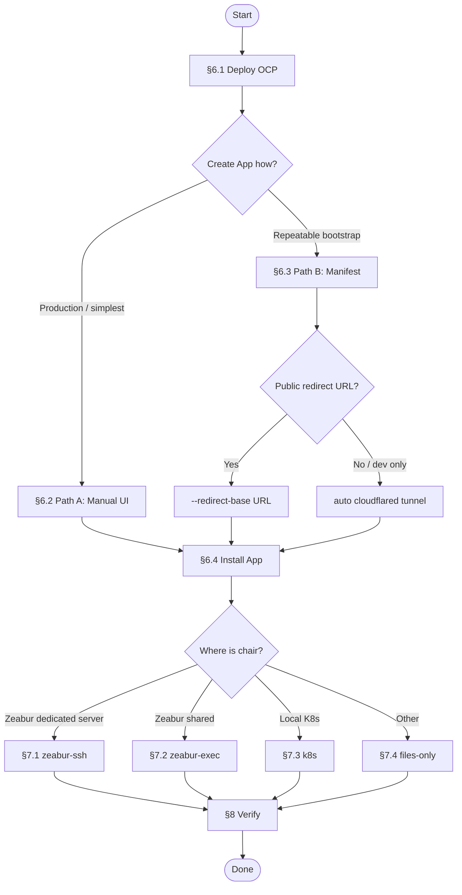

# SOP: GitHub App Install for OpenAB Control Plane

| Field | Value |
|-------|--------|
| **Document** | `docs/install-github-app.md` |
| **Applies to** | OpenAB Control Plane (OCP) template `1E1Y97` and equivalent self-hosted deployments |
| **Audience** | Platform operator installing webhook-triggered PR review for an org or team |
| **Outcome** | GitHub sends `pull_request` / `issue_comment` webhooks to OCP; chair posts verdicts as `<slug>[bot]` |

> **Non-technical quick start (繁體中文，一頁):**
> [install-github-app-quickstart.md](install-github-app-quickstart.md)

## 1. Purpose

Install the **GitHub App track** for OCP: no per-repo copied GitHub Action required.
One App per council deployment; triggers are webhooks; the chair pod posts PR comments
using a GitHub App installation token.

Do **not** use this SOP together with the PAT copied Action ([`install-pat.md`](install-pat.md))
on the same repository — one PR event would convene two councils.

## 2. Scope

**In scope**

- Deploy control plane + chair + reviewers (Zeabur or local K8s).
- Create, install, and wire a GitHub App.
- Configure webhook HMAC secret, chair App identity, and `OABCP_BOT_HANDLE`.

**Out of scope**

- Per-role GitHub App tokens on the plane (advanced; see [`config-reference.md`](config-reference.md)).
- Forum / non-GitHub triggers.
- Reviewer pod GitHub credentials for private repos (see §10).

## 3. Roles and permissions

| Role | Responsibility | GitHub permission needed |
|------|----------------|---------------------------|
| **Deployer** | Runs Zeabur template / K8s deploy; sets plane env vars | Zeabur project access |
| **App creator** | Creates the GitHub App (UI or manifest) | Personal account, or org **Owner** / **Manage GitHub Apps** for org-owned Apps |
| **App installer** | Installs App on target org/repos | Org **Owner** or repo admin for repo-scoped install |
| **Wiring operator** | Runs `setup-github-app.sh`; may need dedicated-server SSH | Zeabur service IDs; `sshpass` + server SSH for `zeabur-ssh` delivery |

## 4. Prerequisites checklist

Complete before starting. Record values in the [artifact worksheet](#12-artifact-worksheet).

- [ ] `PLANE_URL` — public HTTPS base URL (e.g. `https://my-council.zeabur.app`), or local URL + dev tunnel plan
- [ ] `WEBHOOK_SECRET` — `openssl rand -hex 32`; will be plane `GITHUB_WEBHOOK_SECRET`
- [ ] `gh` CLI installed and authenticated (`gh auth login`)
- [ ] Clone of this repo (for `scripts/`)
- [ ] All four services running: `control-plane`, `chair`, `rev1`, `rev2`

**Path-specific (only if used)**

| Path | Extra requirements |
|------|-------------------|
| **A — Manual UI** (§6.2) | None |
| **B — Manifest** (§6.3) | `python3`; optional `cloudflared` if no `--redirect-base` |
| **Zeabur SSH wiring** (§7.1) | `sshpass`, dedicated `SERVER_ID`, `CHAIR_SERVICE_ID`, `PLANE_SERVICE_ID` |
| **Local K8s** (§7.3) | `kubectl`, `scripts/dev-deploy-k8s.sh` completed |

## 5. Procedure selection



| Your situation | Recommended path |
|----------------|------------------|
| Production Zeabur, first-time install | §6.2 Path A + §7.1 `zeabur-ssh` |
| Org-owned App, scripted bootstrap | §6.3 Path B + §7.1 |
| Laptop-only, no public redirect host | §6.3 Path B (cloudflared) + §7.3 or §7.4 |
| Already have App ID + PEM | Skip §6.2/§6.3 → §6.4 → §7 |

Entry script (prints this map): [`scripts/install-github-app.sh`](../scripts/install-github-app.sh)

## 6. Standard procedure

### 6.1 Deploy the control plane

**Action**

```sh
export WEBHOOK_SECRET=$(openssl rand -hex 32)
export PLANE_URL=https://my-council.zeabur.app   # adjust

npx zeabur@latest template deploy -c 1E1Y97 \
  --project-id <PROJECT_ID> \
  --var PUBLIC_DOMAIN=my-council \
  --var CLAUDE_CODE_OAUTH_TOKEN=<CLAUDE_CODE_OAUTH_TOKEN> \
  --var GITHUB_WEBHOOK_SECRET=$WEBHOOK_SECRET \
  --var BOT_TOKEN_CHAIR=$(openssl rand -hex 32) \
  --var BOT_TOKEN_REV1=$(openssl rand -hex 32) \
  --var BOT_TOKEN_REV2=$(openssl rand -hex 32)
```

Local alternative: [`local-development.md`](local-development.md) + `scripts/dev-deploy-k8s.sh`.

**Verify**

- [ ] `control-plane`, `chair`, `rev1`, `rev2` are `Running`
- [ ] `curl -fsS "$PLANE_URL/health"` succeeds (or your deployment's health endpoint)
- [ ] `WEBHOOK_SECRET` saved in the artifact worksheet

---

### 6.2 Path A — Create GitHub App (manual UI)

**When to use:** production, no local tunnel, no Python required.

**Action**

```sh
scripts/register-github-app.sh manual \
  --plane-url "$PLANE_URL" \
  --app-name "My Review Council" \
  --org <org-login>    # omit for personal-account App
```

Follow the printed checklist in GitHub. Required settings:

| Setting | Value |
|---------|--------|
| Homepage URL | `$PLANE_URL` |
| Webhook URL | `$PLANE_URL/api/v1/github_webhooks` |
| Webhook secret | `$WEBHOOK_SECRET` (same as plane) |
| Pull requests | Read and write |
| Contents | Read-only |
| Commit statuses | Read and write |
| Issues | Read and write |
| Events | Pull requests, Issue comments |

Generate and download a **private key** (`.pem`).

**Verify**

- [ ] App ID recorded
- [ ] PEM saved (e.g. `./<slug>.private-key.pem`)
- [ ] App slug recorded (becomes `OABCP_BOT_HANDLE` and `<slug>[bot]`)

**Common failure:** `Default events are not supported by permissions: issue_comment` → add **Issues: Read and write**.

---

### 6.3 Path B — Create GitHub App (manifest)

**When to use:** repeatable org bootstrap; OK with `python3`; cloudflared only if you lack a public redirect URL.

GitHub App **display names are globally unique**. If taken, choose another name.

**B1 — Public redirect (online-friendly, no cloudflared)**

```sh
scripts/register-github-app.sh manifest \
  --plane-url "$PLANE_URL" \
  --app-name "My Review Council" \
  --org <org-login> \
  --redirect-base https://<your-public-host> \
  --output-dir ./github-app-artifacts
```

**B2 — Auto tunnel (local operator machine, dev/bootstrap)**

```sh
scripts/register-github-app.sh manifest \
  --plane-url "$PLANE_URL" \
  --app-name "My Review Council" \
  --org <org-login> \
  --output-dir ./github-app-artifacts
```

Open the printed URL → click **Create … GitHub App** → wait for success page.

**Outputs**

- `./github-app-artifacts/<slug>.private-key.pem`
- `./github-app-artifacts/<slug>.github-app.json` (includes GitHub-generated `webhook_secret`)

**Verify**

- [ ] `id`, `slug`, `webhook_secret` recorded from `.github-app.json`
- [ ] If manifest path: set `WEBHOOK_SECRET` to the JSON `webhook_secret` (overrides §6.1 value on plane in §7)

**Note:** cloudflared is only for the manifest **callback** (`redirect_url?code=…`). Production **webhooks** always go to `$PLANE_URL` directly.

Re-exchange an existing code only:

```sh
scripts/exchange-github-app-manifest.sh \
  --code-file /tmp/github-app-manifest-code.txt \
  --output-dir ./github-app-artifacts
```

---

### 6.4 Install the GitHub App

**Action**

```sh
scripts/register-github-app.sh install-url \
  --slug <app-slug> \
  --org <org-login>
```

Open the URL as org owner (or repo admin for single-repo install). Prefer **All repositories** or select targets explicitly.

**Obtain installation ID**

```sh
scripts/github-app-list-installations.sh \
  --app-id <APP_ID> \
  --key-path ./github-app-artifacts/<slug>.private-key.pem
```

**Verify**

- [ ] At least one installation line printed (`<installation_id>  <org>  all|selected`)
- [ ] Installation ID recorded in artifact worksheet

---

### 6.5 Wire webhook and chair identity

Run exactly one delivery mode from §7.

**Verify (all modes)**

- [ ] `setup-github-app.sh` exits 0
- [ ] GitHub App webhook URL is `$PLANE_URL/api/v1/github_webhooks`
- [ ] Plane `OABCP_BOT_HANDLE` = App slug
- [ ] Plane `GITHUB_WEBHOOK_SECRET` matches App webhook secret
- [ ] Chair `gh auth status` shows `<slug>[bot]` (§8)

## 7. Wiring delivery modes

### 7.1 Zeabur dedicated server (`zeabur-ssh`) — recommended

Avoids `zeabur service exec` 524 timeouts on PEM upload.

```sh
scripts/setup-github-app.sh \
  --app-id <APP_ID> \
  --installation-id <INSTALLATION_ID> \
  --key-path ./github-app-artifacts/<slug>.private-key.pem \
  --plane-url "$PLANE_URL" \
  --webhook-secret "$WEBHOOK_SECRET" \
  --bot-handle <slug> \
  --chair-service-id <CHAIR_SERVICE_ID> \
  --plane-service-id <PLANE_SERVICE_ID> \
  --server-id <SERVER_ID> \
  --chair-home /home/agent \
  --delivery zeabur-ssh
```

| Chair image | `--chair-home` |
|-------------|----------------|
| Kiro (`?agent=kiro`) | `/home/agent` |
| Claude (default template) | `/home/node` |

---

### 7.2 Zeabur shared cluster (`zeabur-exec`)

```sh
scripts/setup-github-app.sh \
  --app-id <APP_ID> \
  --installation-id <INSTALLATION_ID> \
  --key-path ./github-app-artifacts/<slug>.private-key.pem \
  --plane-url "$PLANE_URL" \
  --webhook-secret "$WEBHOOK_SECRET" \
  --bot-handle <slug> \
  --chair-service-id <CHAIR_SERVICE_ID> \
  --plane-service-id <PLANE_SERVICE_ID> \
  --delivery zeabur-exec
```

---

### 7.3 Local Kubernetes (`k8s`)

```sh
scripts/setup-github-app.sh \
  --app-id <APP_ID> \
  --installation-id <INSTALLATION_ID> \
  --key-path ./github-app-artifacts/<slug>.private-key.pem \
  --plane-url http://localhost:8090 \
  --webhook-secret "$WEBHOOK_SECRET" \
  --delivery k8s

scripts/dev-deploy-bots.sh --chair-github-app-secret github-app-chair
```

Point the App webhook at a public URL using [`scripts/dev-webhook.sh`](../scripts/dev-webhook.sh) (dev only).

---

### 7.4 Custom hosting (`files-only`)

```sh
scripts/setup-github-app.sh \
  --app-id <APP_ID> \
  --installation-id <INSTALLATION_ID> \
  --key-path ./github-app-artifacts/<slug>.private-key.pem \
  --plane-url "$PLANE_URL" \
  --webhook-secret "$WEBHOOK_SECRET" \
  --bot-handle <slug> \
  --chair-home /home/agent \
  --delivery files-only
```

Upload `chair-github-app-bundle/` to the chair pod; restart chair.

---

### 7.5 Post-wiring cleanup

If `GH_TOKEN` was ever set on the chair service, delete it — `gh` prefers env token over App login.

```sh
npx zeabur@latest variable delete --id <CHAIR_SERVICE_ID> --delete-keys GH_TOKEN -y -i=false
```

## 8. Verification and acceptance

### 8.1 Chair identity

```sh
# Zeabur (Kiro chair)
npx zeabur@latest service exec --id <CHAIR_SERVICE_ID> -- \
  sh -lc 'HOME=/home/agent gh auth status'

# Local Claude chair
kubectl exec -n oabcp-local deploy/chair -- \
  sh -lc 'HOME=/home/node gh auth status'
```

**Pass:** active account is `<slug>[bot]`.

### 8.2 Webhook path

In GitHub → App → Advanced → Recent deliveries: delivery to
`/api/v1/github_webhooks` returns **200** (after a test event or PR activity).

**Pass:** no persistent 401; plane logs show webhook accepted.

### 8.3 Functional triggers

| Test | Pass criteria |
|------|----------------|
| Open / reopen PR on installed repo | Council convenes; chair posts in-progress then verdict comment |
| Comment `/review` as MEMBER+ | Manual review runs |
| Comment `@<slug> explain this hunk` | Solo follow-up answer (requires `OABCP_BOT_HANDLE`) |

## 9. Rollback

| Step to undo | Action |
|--------------|--------|
| Wrong webhook secret | Align plane `GITHUB_WEBHOOK_SECRET` and App webhook secret; restart plane |
| Wrong chair identity | Re-run §7 with correct PEM / IDs; remove `GH_TOKEN` |
| App installed on wrong repos | GitHub → App → Install → Configure → adjust repositories |
| Decommission council | Uninstall App; remove webhook URL; delete Zeabur project |

## 10. Known constraints

- **Private repos:** reviewer pods need read access to self-fetch diffs; public repos work anonymously.
- **Plane does not need** `GITHUB_APP_ID` / `GITHUB_APP_PRIVATE_KEY` for the pod-local chair path.
- **Manifest code** expires in **one hour** after registration starts.
- **Do not** run PAT Action and App webhook on the same repo.

## 11. Troubleshooting

| Symptom | Likely cause | Fix |
|---------|--------------|-----|
| `issue_comment` permission error on manifest | Missing `issues: write` | Use provided scripts/manifest defaults; or add in UI |
| App name taken | Global name collision | Pick another display name |
| cloudflared 1033 / tunnel dead | Stale quick tunnel | Re-run §6.3 B2 or use §6.2 Path A |
| `zeabur service exec` 524 | Large stdin on shared cluster | §7.1 `zeabur-ssh` |
| Webhook 401 | Secret mismatch | Sync `WEBHOOK_SECRET` plane ↔ App |
| Chair posts as human / wrong bot | Stale `GH_TOKEN` or old PEM | §7.5 + re-run §7 |
| `/review` ignored | User not MEMBER+; or comment on non-PR issue | Check `author_association` and PR thread |
| `@mention` ignored | `OABCP_BOT_HANDLE` unset or wrong | Match App slug exactly |

## 12. Artifact worksheet

Copy and fill during install:

```text
PLANE_URL=________________________
WEBHOOK_SECRET=__________________     # plane GITHUB_WEBHOOK_SECRET
APP_NAME=________________________
APP_ID=__________________________
APP_SLUG=________________________     # → OABCP_BOT_HANDLE
INSTALLATION_ID=__________________
PEM_PATH=_________________________
CHAIR_SERVICE_ID=_________________    # Zeabur only
PLANE_SERVICE_ID=_________________    # Zeabur only
SERVER_ID=________________________    # dedicated server only
CHAIR_HOME=/home/agent or /home/node
```

## 13. Script reference

| Script | SOP step |
|--------|----------|
| [`install-github-app.sh`](../scripts/install-github-app.sh) | Entry / quick reference |
| [`register-github-app.sh`](../scripts/register-github-app.sh) | §6.2 manual, §6.3 manifest, §6.4 install URL |
| [`exchange-github-app-manifest.sh`](../scripts/exchange-github-app-manifest.sh) | §6.3 code exchange |
| [`github-app-list-installations.sh`](../scripts/github-app-list-installations.sh) | §6.4 installation ID |
| [`setup-github-app.sh`](../scripts/setup-github-app.sh) | §7 wiring |
| [`get-gh-app-token.sh`](../scripts/get-gh-app-token.sh) | Token minter (installed on chair) |
| [`dev-webhook.sh`](../scripts/dev-webhook.sh) | Local dev webhook tunnel only |